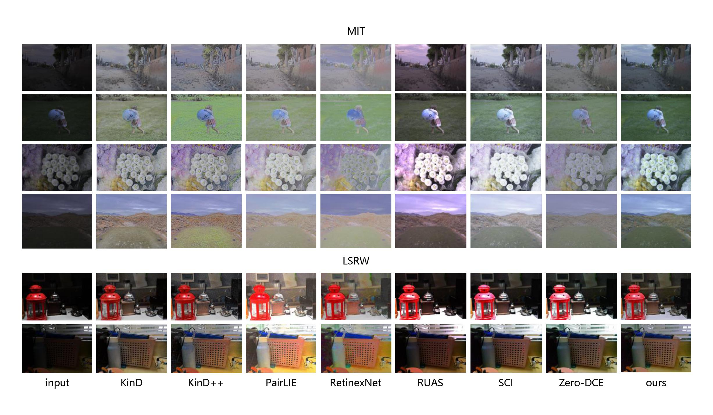
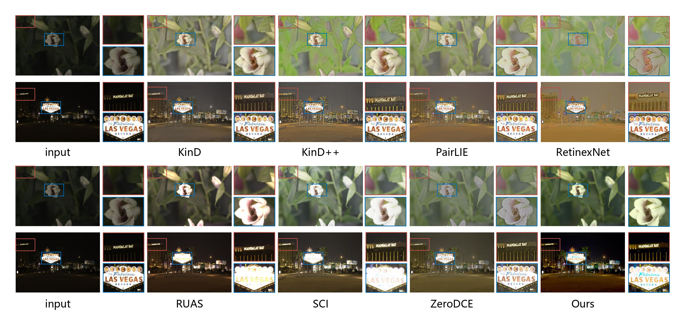

Detail Enhancement through Laplacian Pyramid and U-net for Image Processing
# Code
## Requirements
- python3.7
- pytorch==1.8.0
- cuda11.1
## test
- 请将snapshots.zip解压缩到文件夹中
- 将测试图片放入data文件夹中
- Run"test.py"
## contrast

